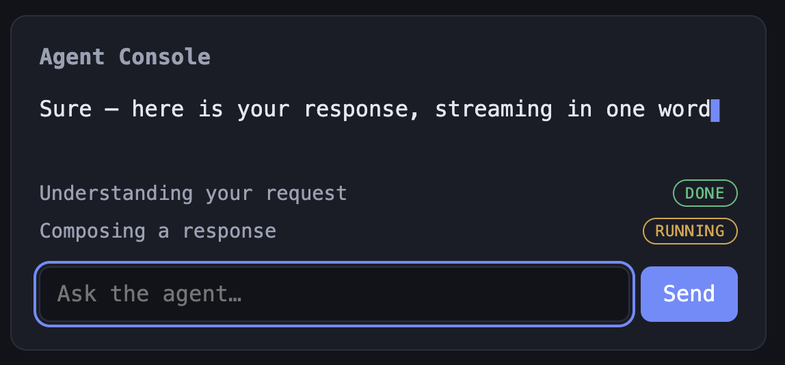

# Agent Console

A single console-style panel where a user types a request in plain English, an AI agent
streams back a response token-by-token, and a live action-tracker shows steps updating in
real time (pending → running → done).

Built as a scoped practice project focused on the skills an AI-native, agentic/chat-driven
UI actually needs: streaming state, a live status tracker, accessible-by-default components,
and an architecture that swaps a mock for a real backend without touching the UI.

**🔗 Live demo:** https://streaming-conversation-1.onrender.com
_(First load may take ~50s while the free backend wakes from idle.)_



## The core idea: one seam

**All backend behavior lives behind a single function — `sendMessage()` — that streams
updates back to the UI. Components render whatever comes out and never know whether it's
real or mocked.**

```
Composer ──▶ sendMessage(text, onUpdate) ──▶ onUpdate(snapshot) ──▶ React state ──▶ UI repaints
                     │
                     └─ v1: fake tokens on a timer
                        v2: a real streaming LLM endpoint  (only the INSIDE changes)
```

- **v1:** `sendMessage()` emitted fake tokens on a timer and flipped the action steps
  through their states.
- **v2 (current):** only the *inside* of `sendMessage()` was rewritten to call a real
  streaming LLM (Google Gemini) behind a key-holding backend proxy. The data shape it emits
  is unchanged, so **not a single component changed** — the seam held.

This boundary is deliberate. Mock logic is never scattered inside components — that seam is
the whole point of the design.

## The data contract

`sendMessage()` emits **snapshots** — each update is the *complete* current state of the
panel, not an incremental delta. This keeps components dumb: they render the latest snapshot
and never accumulate state themselves. (In v2, the real token deltas from the network get
stitched into snapshots *inside* the seam, so the contract stays identical.)

```ts
type StepStatus = 'pending' | 'running' | 'done'

interface ActionStepData {
  id: string
  label: string
  status: StepStatus
}

interface ConversationState {
  text: string             // reply so far
  isStreaming: boolean     // drives the typing indicator
  steps: ActionStepData[]  // the tracker rows
  error: string | null     // null = fine; a message = show the error state
}
```

All four UI states fall out of this one shape:

| State   | Condition                           |
| ------- | ----------------------------------- |
| Empty   | `text === '' && steps.length === 0` |
| Loading | `isStreaming === true`              |
| Happy   | `text` has content                  |
| Error   | `error !== null`                    |

## Components

Four reusable components, each self-contained, composed under a single panel:

```
ConsolePanel            holds state, calls the seam, arranges the layout
├── StreamingMessage    renders the reply + typing cursor
├── ActionTracker       maps steps → rows
│   └── ActionStep      one row: label + status
│       └── StatusBadge the pending/running/done pill (reused)
└── Composer            input + send button (Enter or click)
```

## Tech choices

- **Vite + React + TypeScript** — lean SPA tooling; TypeScript makes the data contract
  enforceable (e.g. `StepStatus` rejects a typo'd status at compile time).
- **Vitest + React Testing Library** — tests are written against *behavior a user observes*
  (type, click, Enter), not internals, so they survive refactors.
- **vitest-axe** — accessibility violations are caught automatically in CI.
- **Plain CSS** — components are styled from scratch (no UI library) on purpose, using CSS
  variables, flexbox, and a `state → class → color` pattern for the status pills.

## Testing

Tests target where the *logic* lives, not every line. `Composer` has real behavior (guards,
Enter/click paths, clearing) so it gets the most coverage, including the edge case (empty
input sends nothing). Presentational components get a single render check. Accessibility is
tested with axe as a baseline — with the understanding that automated tools are a floor, not
a ceiling, so the keyboard flow is also verified by hand.

## Accessibility

- Fully keyboard-operable: Tab to focus, Enter/Space to send, visible `:focus-visible` rings.
- The input has a real accessible name (`aria-label`), not just a placeholder.
- `role="alert"` announces errors to screen readers.
- axe runs in CI on every push.

## Scope

**v1 (done):** type a request (Enter + button) · token-by-token streaming with a typing
state · live action tracker through pending/running/done · loading/empty/error states · four
reused components · keyboard + axe · component tests green · CI on push · this README.

**Out of scope for v1 (deliberately):** real LLM backend, multiple agents, a second screen,
auth, persistence, multi-turn memory, theming/animations, deploy.

**v2 — make it real (done).** The mock inside `sendMessage()` was replaced with a real
streaming LLM (Google Gemini) behind a key-holding backend proxy, deployed live:

1. Restructured into a monorepo — `frontend/` + `backend/`, each with its own `package.json`.
2. Backend proxy streams tokens from Gemini over Server-Sent Events (SSE).
3. The API key lives only in server env — never in browser-shipped code.
4. Real token deltas fold into the existing `ConversationState` shape — **zero component edits.**
5. Network / LLM failures (including cut-off streams) surface through the existing error state.
6. Deployed on Render (static frontend + Node backend), CI/CD on push. Live link above.
7. Single exchange only — no multi-turn (still a later milestone).
8. The delta → snapshot mapping is covered by tests; the live network call is not.

**v3 — make it agentic.** Give the model real tools so each tool call drives a live
`ActionStep` (pending → running → done) as it actually happens.

**Later / maybe:** multi-turn conversation history (a model-level change — its own milestone),
multiple agents, off-console surface, design-system extraction.

## Running locally

Requires Node 22 (see `.nvmrc`). The app is a monorepo — frontend and backend run separately.

**Backend** (needs a Google Gemini API key):

```bash
cd backend
npm install
echo "GEMINI_API_KEY=your_key_here" > .env
npm run dev      # http://localhost:3000
```

**Frontend:**

```bash
cd frontend
npm install
npm run dev      # http://localhost:5173  (proxies /api to the backend)
npm test         # run the test suite
```
